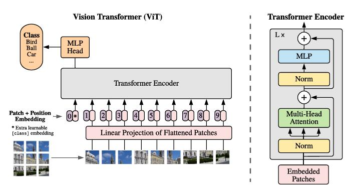
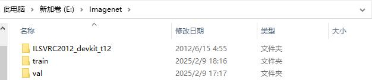
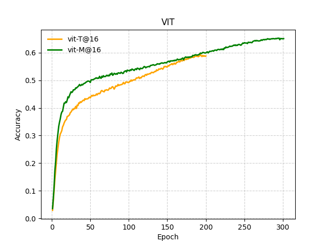
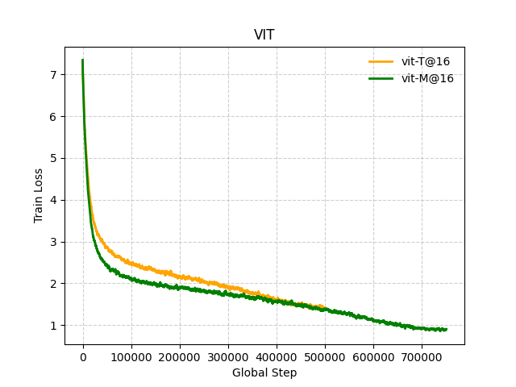
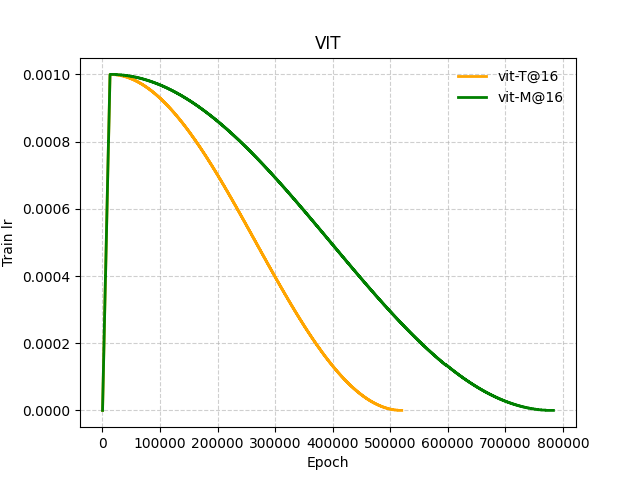

# 🤖从0实现vision transformer在imagenet1k上训练，只需要单卡4090

> 这是一个学习项目，能够实现完整的训练过程，Tiny版本大约需要三天，Mini版本大约需要四天

---

## 💭思考
- 1、在某些环境中，可能没有那么大的计算资源，或者需要实时推理，因此小模型也有用。  
Vit-Base就有86M的参数，而我训练的Vit-Tiny和Vit-Mini只有3M和5.7M。
- 2、精度差距，Vit-Base的精度是72%-73%，Vit-Tiny的精度是58.77%。
- 3、训练速度，Vit-Base预估应该是Vit-Tiny的10倍，而且单卡几乎不可训练。
- **4、在一个训练loss曲面的高点在进行预训练CLIP等模型是否能够更好地适配其他模态(后续研究!)。**

## 🧠模型结构
</img>
```python
@dataclass
class Config:
    img_size: int = 224 # 图像尺寸
    patch_size: int = 16 # patch尺寸
    channel: int = 3 # 图片通道数
    dim: int = 192 # transformer模型维度
    dropout_rate: float = 0.0 # dropout概率
    n_class: int = 1000 # 分类数
    # transformer
    n_head: int = 3 # transformer的head数
    n_layer: int = 12 # transformer的层数
    mode: str = 'cls' # 输出层之前的聚合方式，可选cls和mean
```
- Tiny版本，参数量：3041320，n_layer = 6，epoch = 200
- Mini版本，参数量：5701288，n_layer = 12，epoch = 300

## 🚀训练
- 1、下载imagenet1k数据集，训练集自行下载，测试集和meta数据可以到这个地址下载：
[HuggingFace](https://huggingface.co/datasets/royyu/imgnet1k/tree/main)  
[GoogleDrive](https://drive.google.com/drive/folders/1aJx5uSsPYmqmjBzvwjfAObc1X0CEZWrT?usp=drive_link)  
如果自己处理测试集，只需要将测试集的图片按训练集的方法以文件夹存放即可，最后将train，val，meta数据三个文件夹放在一个imagenet文件夹下即可。
</img>
- 2、修改config.py和train.py的参数
- 3、运行train.py

## 📝结果
| Model     | Epoch | Accuracy |
|-----------|-------|----------|
| ViT-T@16  | 200   | 58.77%   |
| ViT-M@16  | 200   | 59.89%   |
| ViT-M@16  | 300   | 65.07%   |

---

</img>
</img>
</img>

